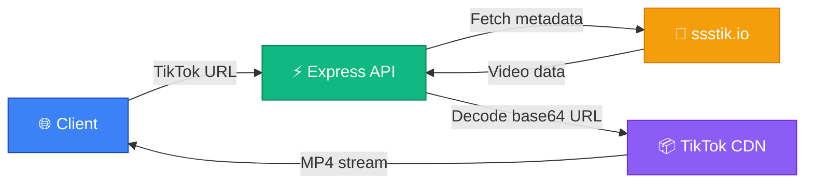

# sstiktok-downloader

## 📘 Overview

This is a **server-side scraper wrapper** around [ssstik.io](https://ssstik.io) that retrieves **HD TikTok download links** — without ads, watermarks, or requiring user interaction.
The backend resolves the final MP4 URL and proxies it directly to the browser with a sanitized filename.

> [!WARNING]
> **Legal & Ethical Notice:** This project is for **educational and research use only**. It wraps ssstik.io to extract video metadata and proxies MP4 streams. Users must follow TikTok's and ssstik.io's ToS, only download content they own or have permission for, and ensure local compliance. The authors assume no liability for misuse.

## ✨ Features

* 🎥 **HD/FullHD downloads** – No watermark
* 🚫 **No ad gate** – Direct API calls (no ssstik.io UI)
* ⚡ **One-click download** – Paste & go
* 📋 **Clipboard integration**
* 🧩 **Smart filenames** – `username-timestamp.mp4` (extracts @username from TikTok URL when author name is emojis)
* 🧭 **Responsive UI** – Mobile + desktop
* 💡 **Helpful errors** – Clear, categorized error messages with suggestions
* 🐳 **Docker ready** – Simple deployment
* ❤️ **Health checks** – `/api/health` endpoint + Docker healthcheck
* 📥 **Download queue system** – Add multiple URLs, processed sequentially
* 🎬 **Video metadata display** – Shows author and video description
* 🔄 **Retry mechanism** – Exponential backoff with up to 10 retry attempts
* 👁️ **Real-time retry visibility** – See live attempt progress with wait times via Server-Sent Events
* ⏱️ **Request timeout** – 5-minute client-side timeout for hung requests
* ✅ **URL validation** – Client-side format validation with real-time feedback

## 🧠 How It Works



1. **Fetch video metadata** from ssstik.io
2. **Extract hx-redirect URL** containing base64-encoded video URL
3. **Decode base64** to get direct TikTok CDN URL (bypassing tikcdn.io proxy)
4. **Resolve final URL** with proper headers and redirects
5. **Proxy MP4 stream** to the browser

> Because requests are handled server-side, users never see ssstik.io's ads.

## 🖥️ Tech Stack

### Frontend

* React 19 + TypeScript 5.6
* Vite 6 (dev server & build tool)
* Tailwind 4 + Radix UI + Lucide React
* Axios (HTTP client)

### Backend

* Node.js 20+ + Express 4.18
* Cheerio (HTML parsing)
* Axios + CORS

### DevOps

* Docker + Docker Compose
* Alpine Linux base image

## 🚀 Installation

### Local development

```bash
git clone https://github.com/rizkyilhampra/sstiktok-downloader.git
cd sstiktok-downloader
npm install
```

Create `.env`:

```env
PORT=3000
```

Run both servers:

```bash
# Terminal 1 – backend
npm run server

# Terminal 2 – frontend
npm run dev
```

**URLs:**

* Frontend: [http://localhost:5173](http://localhost:5173)
* Backend: [http://localhost:3000](http://localhost:3000)

Vite proxies `/api/*` to the backend.

### Docker

```bash
docker-compose up --build
```

App available at [http://localhost:3000](http://localhost:3000)

### Local production

```bash
npm run start
```

Builds the frontend and serves app + API on port 3000.

## 🧩 Usage

### Basic Download

1. Open the app in your browser
2. Paste a TikTok URL into the input field
3. The URL is automatically added to the queue
4. Videos are downloaded sequentially
5. The backend proxies the HD stream to your browser

### Queue Management

* **Add to queue** – URLs auto-added after 1.5 seconds of input (with validation)
* **Clipboard paste** – Use the clipboard button for instant queue addition
* **Retry failed** – Click retry button on failed items to reprocess
* **Remove items** – Delete videos from queue with confirmation
* **Clear completed** – Bulk remove all successfully downloaded items

### Features

* **Metadata display** – Each queue item shows video author and description
* **Error suggestions** – Failed downloads show actionable error messages
* **Retry attempts** – Automatic retries (up to 10) with exponential backoff
* **Request timeout** – 5-minute timeout prevents hung requests
* **Real-time validation** – URL format checked before queue addition

**Supported URL formats:**

```
https://www.tiktok.com/@username/video/123456789
https://vm.tiktok.com/XXXXXXXXXX
https://vt.tiktok.com/XXXXXXXXXX
```

## 🧰 API Endpoints

| Endpoint              | Method | Description                                            |
| --------------------- | ------ | ------------------------------------------------------ |
| `/api/download`       | `POST` | Process TikTok URL and return final HD link + filename |
| `/api/progress/:requestId` | `GET` (SSE) | Stream real-time retry attempt updates         |
| `/api/proxy-download` | `GET`  | Stream video file to client                            |
| `/api/health`         | `GET`  | Health check endpoint                                  |

### Download Flow Details

The `/api/download` endpoint performs the following steps:

1. **Scrape ssstik.io** – Fetch video metadata and HD download data
2. **Get hx-redirect URL** – Extract base64-encoded URL from response headers
3. **Decode base64** – Extract actual TikTok CDN URL (e.g., `https://v16.tokcdn.com/...`)
4. **Resolve final URL** – Follow redirects to get playable video URL
5. **Generate filename** – Uses author name, or extracts `@username` from TikTok URL if author name contains only emojis
6. **Return metadata** – Provides download URL, quality, filename, author, and description


## 🧱 Project Structure

```
sstiktok-downloader/
├── public/                # Static assets
├── src/                   # React + TS source
│   ├── components/
│   ├── App.tsx
│   └── main.tsx
├── server/                # Express backend
│   └── index.js
├── dist/                  # Production build
├── Dockerfile
├── docker-compose.yml
├── vite.config.ts
├── package.json
└── .env
```

## 📄 License

Released under the **MIT License**.
See [LICENSE](LICENSE) for details.
