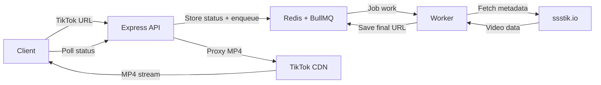

# Technical Reference

Internal architecture, the download pipeline, and the HTTP API. For setup and product overview see the [README](../README.md).

## How it works



1. **Enqueue.** `POST /api/download` validates the URL, writes a `queued` job to Redis, and enqueues a BullMQ job. The `jobId` is returned immediately.
2. **Scrape.** A worker fetches video metadata and HD download data from ssstik.io. Throws if HD is unavailable.
3. **Extract redirect.** The base64-encoded video URL is pulled from the `hx-redirect` response header.
4. **Resolve.** The base64 payload is decoded to the TikTok CDN URL (e.g. `https://v16.tokcdn.com/...`) and redirects are followed to the final playable URL.
5. **Persist.** The worker saves the resolved URL, quality, author, description, and generated filename back to Redis.
6. **Deliver.** The client polls job status; on `completed` it requests `/api/proxy-download`, which streams the MP4 (with range support) and sets a download filename.

Because every request is handled server-side, users never see ssstik.io's ads.

### Pipeline details

* **Filename generation** — uses the scraped author name. If the author name is only emojis (sanitizes to empty), the worker fetches the TikTok page and extracts `@username` from the embedded `__UNIVERSAL_DATA_FOR_REHYDRATION__` JSON or the canonical URL. Falls back to `unknown`. Format: `username-timestamp.mp4`.
* **Retries** — each job runs up to **5 attempts total** (1 initial + 4 retries) with exponential backoff: base 2s, doubling per attempt, capped at 30s. Configured by `DEFAULT_MAX_ATTEMPTS` in `server/config.ts`.
* **Timeouts** — each scrape step has a 15s timeout (`STEP_TIMEOUT_MS`); the proxy upstream request has a 30s timeout.
* **Client poll** — the frontend polls every 1.5s with a **5-minute ceiling**; a job still unresolved after that is marked failed client-side. Polling fires immediately when a backgrounded tab becomes visible again.
* **Idempotency** — job creation uses Redis `SET NX`; reusing a `requestId` returns the existing job instead of enqueuing a duplicate.
* **Job TTL** — job state expires from Redis after `JOB_TTL_SECONDS` (default 600s).

## API endpoints

| Endpoint              | Method | Description                                                          |
| --------------------- | ------ | -------------------------------------------------------------------- |
| `/api/download`       | `POST` | Enqueue a TikTok URL. Returns `{ jobId, maxAttempts }` immediately.   |
| `/api/jobs/:jobId`    | `GET`  | Poll job status (`queued` / `processing` / `completed` / `failed`).  |
| `/api/proxy-download` | `GET`  | Stream the video file to the client. Supports HTTP range requests.   |
| `/api/health`         | `GET`  | Health check — returns `{ status: "ok" }`.                           |
| `/api/config`         | `GET`  | Client runtime config: `maxClientConcurrentDownloads`, `maxAttempts`. |

### `POST /api/download`

Body: `{ "url": string, "requestId"?: string }`. The `url` must contain `tiktok.com`. A client-supplied `requestId` is used as the idempotency key (and `jobId`); if omitted, the server generates one.

* `200` → `{ jobId, maxAttempts }`
* `400` → `{ success: false, error, errorType, suggestion? }` (missing or invalid URL)
* `503` → queue unavailable

### `GET /api/jobs/:jobId`

Returns the full job record. While in progress, `attempt`, `maxAttempts`, and `retryDelay` reflect retry state. On `completed`, includes `downloadUrl`, `quality`, `filename`, `author`, `description`. On `failed`, includes `error`, `errorType`, `suggestion`. Returns `404` once the job has expired.

### `GET /api/proxy-download`

Query: `jobId` (required), `filename` (optional override). Only serves jobs in `completed` state with a resolved URL. Forwards the client's `Range` header upstream and mirrors `Content-Type`, `Content-Length`, `Content-Range`, and `Accept-Ranges` so downloads can resume and seek. Sets `Content-Disposition: attachment` with the generated filename.

### Error types

Failures are categorized into `errorType` values, each with a user-facing message and suggestion: `INVALID_INPUT`, `INVALID_URL`, `NETWORK_ERROR`, `RATE_LIMIT_ERROR`, `VIDEO_NOT_FOUND`, `PARSE_ERROR`, `UNKNOWN_ERROR`. Mapping logic lives in `server/utils/errors.ts`.

## Architecture

The API server and the worker are separate processes that share state through Redis. The API never does scraping work itself — it only validates input, manages job records, and proxies the final stream. All scraping and resolution happens in the worker, so slow upstreams never block the API.

* **Frontend** — React SPA. Uses the native `fetch` API (no Axios on the client). Job scheduling, the concurrency limiter, and polling live in `src/hooks/usePollJob.ts` and `src/App.tsx`.
* **API** — Express app (`server/app.ts`), composed of small routers under `server/routes/`.
* **Worker** — BullMQ `Worker` (`server/worker.ts`) running the pipeline in `server/services/downloadJob.ts`.
* **State** — Redis holds job records (`server/services/jobStore.ts`) and backs the BullMQ queue (`server/services/downloadQueue.ts`).
* **Scaling** — both the API and worker scale horizontally (Docker Compose runs 2 app + 3 worker replicas behind nginx by default). `MAX_CLIENT_CONCURRENT_DOWNLOADS` caps how many jobs a single client runs at once; `WORKER_CONCURRENCY` caps concurrent jobs per worker process.

### Configuration

All settings come from environment variables, parsed in `server/config.ts`:

| Variable                          | Default                  | Purpose                                          |
| --------------------------------- | ------------------------ | ------------------------------------------------ |
| `PORT`                            | `3000`                   | API / static server port                         |
| `REDIS_URL`                       | `redis://localhost:6379` | Redis connection string                          |
| `JOB_TTL_SECONDS`                 | `600`                    | How long job state lives in Redis                |
| `MAX_CLIENT_CONCURRENT_DOWNLOADS` | `3`                      | Per-client parallel download cap (sent to client) |
| `WORKER_CONCURRENCY`              | `1`                      | Concurrent jobs per worker process               |

### Project structure

```
sstiktok-downloader/
├── public/                     # Static assets
├── src/                        # React + TS frontend
│   ├── components/
│   │   ├── QueueDisplay.tsx
│   │   └── ui/                 # shadcn/ui primitives
│   ├── hooks/
│   │   └── usePollJob.ts       # job scheduling + polling
│   ├── types/
│   │   ├── api.ts
│   │   └── queue.ts
│   ├── lib/utils.ts
│   ├── App.tsx
│   └── main.tsx
├── server/                     # Express API + BullMQ worker
│   ├── app.ts                  # Express app factory
│   ├── index.ts                # API entrypoint
│   ├── worker.ts               # Worker entrypoint
│   ├── config.ts               # Env-driven config
│   ├── routes/                 # download, jobs, proxyDownload, health, config
│   ├── services/               # downloadJob, downloadQueue, jobStore, redis, tiktokApi
│   ├── utils/                  # errors, filename, retry
│   └── types/server.ts
├── docs/
│   └── TECHNICAL.md
├── dist/                       # Production build output
├── nginx.conf                  # Reverse proxy config (Docker)
├── components.json             # shadcn/ui config
├── Dockerfile
├── docker-compose.yml
├── vite.config.ts
└── package.json
```

## Scaling

Both the API and the worker scale horizontally. The Docker Compose stack runs 2 app replicas and 3 worker replicas behind nginx by default. Tune the replica counts and concurrency to match your server:

| Server   | Suggested settings                                                                |
| -------- | --------------------------------------------------------------------------------- |
| 1 core   | `app=1`, `worker=1`, `MAX_CLIENT_CONCURRENT_DOWNLOADS=1`, `WORKER_CONCURRENCY=1`   |
| 2 cores  | `app=1`, `worker=1–2`, `MAX_CLIENT_CONCURRENT_DOWNLOADS=2`, `WORKER_CONCURRENCY=1` |
| 4+ cores | `app=2–3`, workers on remaining cores, concurrency near worker capacity            |

Override replica counts at launch:

```bash
docker-compose up --build --scale app=N --scale worker=M
```

`MAX_CLIENT_CONCURRENT_DOWNLOADS` caps how many jobs a single client runs at once; `WORKER_CONCURRENCY` caps concurrent jobs per worker process.
